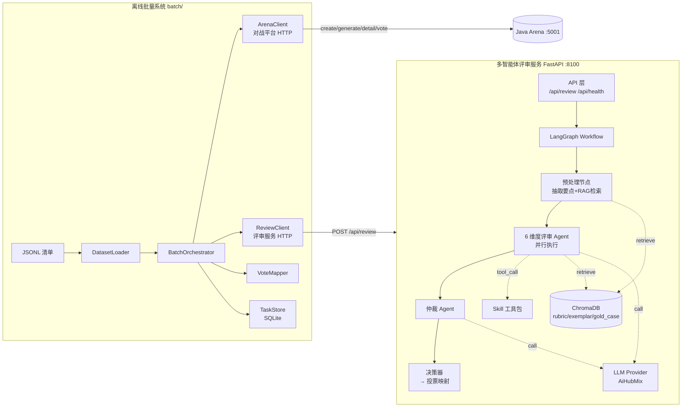

## 用户需求

在现有 Java 对战平台（edu-arena-java）之外，**新建一个独立 Python 子项目 `agent-review-service/`**，包含两大协同系统，用于替代人类专家对大模型批改作文结果进行自动评审并回写到对战平台。

## 系统一：多智能体作文批改评审系统（核心重点）

作为**独立 FastAPI 服务**（端口 `8100`）提供评审能力：

- **输入**：对战上下文（battle_id、作文题目、可选作文原图、responseA / responseB 两份 AI 批改）
- **输出**：结构化评审报告（6 个维度各自 0-5 分数 + 理由、整体评价 winner、综合置信度、可追溯的证据链）
- **编排**：采用 LangGraph DAG 工作流
- 预处理节点：作文信息整理、提取两份批改的结构化要点（亮点/问题/建议）、RAG 检索上下文
- 6 个维度评审 Agent 并行执行：主旨 / 想象 / 逻辑 / 语言 / 书写 / 整体评价
- 仲裁 Agent：汇总六维打分、冲突消解、生成最终 winner 与置信度
- 决策器：把评审报告映射为对战平台的 6 维投票（整体评价决定 winner，其余 5 维按 A/B 分数差映射 A/B/tie）
- **RAG 知识库（ChromaDB）**：
- `rubric`：各维度评分标准
- `exemplar`：不同分数段范文 + 批语
- `gold_case`：历史高一致人工评审案例（few-shot）
- **Skill 工具包**：领域工具（中文字数/病句/重复检测、两份批改内容对比、批改覆盖度分析、幻觉/捏造检测等）供 Agent 节点调用
- **不引入 MCP**

## 系统二：离线批量处理系统

作为评审服务的**客户端批跑工具**：

- **输入**：JSONL 清单文件，每行一条记录（作文题目、图片本地路径列表、可选元数据）
- **流程**：读清单 → 加载图片转 base64 → 登录 Java 平台获取 JWT → `POST /api/battle/create` → `POST /api/battle/{id}/generate` → `GET /api/battle/{id}` → HTTP 调评审服务 `/api/review` → 决策器转投票 payload → `POST /api/battle/{id}/vote`
- **特性**：断点续跑（MySQL 或本地 SQLite 任务状态表）、失败重试（指数退避）、并发控制、进度日志、结果 JSONL 落盘

## 抽象接口契约（两系统共享 `contracts/` 模块）

- `ReviewRequest / ReviewResponse`：评审服务输入输出
- `BattleContext / DimensionScore / ReviewReport`：内部共用数据模型
- `ArenaCreateBattleRequest / ArenaVoteRequest / ArenaBattleDetail`：对战平台 API DTO（字段 snake_case 严格对齐 Java 端）
- `DatasetItem`：离线清单条目模型
- 所有 DTO 基于 Pydantic，输出 JSON 使用 snake_case

## 技术栈

| 类别 | 选型 |
| --- | --- |
| 语言/运行时 | Python 3.11+ |
| Web 框架 | FastAPI + Uvicorn（评审服务 HTTP 接口） |
| Agent 编排 | LangGraph（DAG 工作流） + LangChain Core |
| LLM 调用 | 复用 Java 平台相同的 AiHubMix OpenAI 兼容网关（openai SDK，支持多模态） |
| RAG 向量库 | ChromaDB（本地持久化，零运维） |
| Embedding | OpenAI text-embedding（或本地 bge-small 可切换） |
| 数据建模 | Pydantic v2（DTO + 严格校验） |
| HTTP 客户端 | httpx（异步、重试） |
| 任务状态存储 | SQLite（默认，零依赖）/ MySQL（可选，复用对战平台库） |
| 日志 | loguru（结构化 JSON 日志 + 轮转） |
| 配置 | pydantic-settings + `.env` |
| 并发 | asyncio + 信号量限流 |
| 包管理 | pip + `requirements.txt` |


## 实现方案

### 总体架构

两系统解耦为独立进程，通过 HTTP 通信；共享 `contracts/` 模块保证 DTO 一致。



### 关键技术决策

1. **LangGraph 而非 AutoGen**：DAG 状态机可视化、每节点可独立重试、状态显式存于 `GraphState`，方便调试与 token 成本控制；6 维度并行评审用 LangGraph fan-out/fan-in。
2. **Skill 而非 MCP**：Skill 作为 Python 包内的纯函数工具集（`skills/` 目录），每个 Skill 实现统一抽象 `BaseSkill.run(input) -> output`，通过注册表暴露给 LangGraph 节点。避免引入 MCP server 带来的额外进程/协议复杂度。
3. **严格的契约层 `contracts/`**：两系统共用 Pydantic 模型，字段 alias 使用 snake_case 与 Java 后端对齐。通过 `model_config = ConfigDict(populate_by_name=True, alias_generator=to_snake)` 统一序列化。
4. **评审→投票映射在决策器层完成**：评审 Agent 只负责打分和理由，避免领域耦合；`VoteMapper.to_vote_request(report) -> ArenaVoteRequest` 封装所有业务规则（整体评价直接决定 winner，前 5 维按 `|scoreA - scoreB| >= threshold` 判 A/B，否则 tie）。
5. **断点续跑**：任务状态表记录 `(item_id, battle_id, stage, status, retry_count, last_error)`，阶段粒度为 `created/generated/reviewed/voted/done/failed`，重启后从最后成功阶段续跑。
6. **复用对战平台 LLM 网关**：复用 `ai.base-url` / `ai.api-key` 环境配置，避免新引入 LLM 凭据管理。

### 性能与可靠性

- **并行评审**：6 个维度 Agent 并行（LangGraph Send API），总耗时 ≈ max(单维度) 而非 sum。
- **并发控制**：离线批量用 `asyncio.Semaphore` 限制同时进行的对战数（默认 3），避免触发 Java 平台每日 50 次限流和 LLM QPS 限制。
- **缓存**：RAG 检索结果按 `hash(query) -> topK` 内存 LRU 缓存（同一批任务同一题目复用）。
- **重试策略**：HTTP 层（httpx Transport Retry）+ 业务层（指数退避 3 次，5xx/超时才重试，4xx 直接失败）。
- **幂等**：对战平台 `POST /vote` 有 `UNIQUE(battle_id, user_id)` 约束，客户端捕获 409/重复错误视为成功。
- **日志**：loguru 按 `item_id`/`battle_id`/`stage` 打结构化字段，不打印图片 base64 和 LLM 原始长文本（仅摘要 + 长度）。

### 实现注意事项

- **不修改 Java 代码**：所有对战流程通过 REST API 交互，完全复用 WIKI 文档中的 5 个接口。
- **JSON 命名**：FastAPI `response_model` + Pydantic alias 统一 snake_case，禁止裸 dict 返回。
- **图片处理**：`ImageEncoder` 支持本地路径 / URL / 已压缩 base64 三种输入，遵循 Java 平台压缩后上限（总体积 ≤ 10MB 左右）；超限时本地用 Pillow 先压。
- **敏感信息**：`.env` 中 `AI_API_KEY`、`ARENA_PASSWORD` 仅通过 `pydantic-settings` 读取，日志中以 `***` 脱敏。
- **爆炸半径控制**：评审服务对 Java 平台只读依赖（不写库）；所有写操作只发生在离线系统的投票阶段，可通过 `--dry-run` 模式仅落地评审结果不投票。

## 目录结构

```
edu-arena-java/
└── agent-review-service/                             # [NEW] 独立 Python 子项目
    ├── README.md                                     # [NEW] 项目说明+架构图+启动指南
    ├── requirements.txt                              # [NEW] 依赖: fastapi, uvicorn, langgraph, langchain-core, openai, chromadb, httpx, pydantic, pydantic-settings, loguru, pillow, tenacity
    ├── .env.example                                  # [NEW] 配置样例: AI_API_KEY/AI_BASE_URL/ARENA_BASE_URL/ARENA_USERNAME/ARENA_PASSWORD/CHROMA_DIR/REVIEW_PORT
    ├── pyproject.toml                                # [NEW] 项目元数据 + ruff/black 配置
    │
    ├── app/
    │   ├── __init__.py
    │   ├── main.py                                   # [NEW] FastAPI 入口，路由注册，启动 uvicorn；端口 8100
    │   ├── settings.py                               # [NEW] pydantic-settings 统一读取 .env
    │   │
    │   ├── contracts/                                # [NEW] 两系统共享契约层（核心）
    │   │   ├── __init__.py
    │   │   ├── arena_dto.py                          # 对战平台 REST API 的请求/响应 Pydantic 模型 (ArenaLoginRequest, ArenaCreateBattleRequest, ArenaBattleDetail, ArenaVoteRequest, ArenaVoteResult); snake_case 严格对齐 Java JacksonConfig
    │   │   ├── review_dto.py                         # 评审服务对外 API 模型 (ReviewRequest含 battle_id/essay_title/response_a/response_b/optional images; ReviewResponse 含 report+vote_payload)
    │   │   ├── review_models.py                      # 评审内部领域模型 (DimensionKey 枚举, DimensionScore{score_a, score_b, reason_a, reason_b, winner, confidence}, ReviewReport, BattleContext)
    │   │   └── dataset_dto.py                        # DatasetItem 离线清单条目 (item_id, essay_title, image_paths, metadata)
    │   │
    │   ├── review/                                   # [NEW] 多智能体评审核心（重点模块）
    │   │   ├── __init__.py
    │   │   ├── service.py                            # ReviewService 外观类: run(ReviewRequest)->ReviewResponse，编排图执行与异常兜底
    │   │   ├── graph.py                              # LangGraph 工作流装配: StateGraph 定义 + 节点注册 + 条件边; 暴露 build_graph()
    │   │   ├── state.py                              # GraphState TypedDict: battle_ctx, extracted_points_a/b, rag_hits, dimension_scores:Dict[str,DimensionScore], arbitration, errors
    │   │   ├── nodes/
    │   │   │   ├── __init__.py
    │   │   │   ├── preprocess.py                     # 预处理节点: 从 responseA/B 抽取要点结构化(亮点/问题/建议), 触发 RAG 检索填充 rag_hits
    │   │   │   ├── dimension_agent.py               # 单维度评审 Agent 通用实现: 接收(维度定义+rubric+exemplar+两份批改), 输出 DimensionScore; 通过 dim_key 参数化
    │   │   │   ├── arbitrator.py                     # 仲裁 Agent: 综合 6 维打分, 检查冲突(如整体 winner 与子维度多数相反时修正), 输出最终 ReviewReport
    │   │   │   └── dispatch.py                       # 并行 fan-out: LangGraph Send 把 6 个维度分派到 dimension_agent
    │   │   ├── prompts.py                            # 各维度 system prompt 模板 + 仲裁 prompt + 预处理抽取 prompt; 占位符接入 rubric/exemplar/gold_case 上下文
    │   │   ├── llm.py                                # LLMClient 封装: openai AsyncClient, 支持多模态, 重试, JSON mode; 读取 settings.ai_*
    │   │   └── decision.py                           # VoteMapper: ReviewReport -> ArenaVoteRequest; 整体评价决定 winner, 其余维度按分差阈值映射 A/B/tie, 附带理由截断
    │   │
    │   ├── rag/                                      # [NEW] RAG 知识库
    │   │   ├── __init__.py
    │   │   ├── store.py                              # ChromaStore: get_or_create_collection, add_documents, query(topK); 按 collection_name 隔离 rubric/exemplar/gold_case
    │   │   ├── retriever.py                          # Retriever 门面: retrieve(dim_key, query)->List[Doc]; 支持多集合合并召回 + 去重 + MMR
    │   │   ├── embedding.py                          # EmbeddingProvider 抽象 + OpenAIEmbedding 实现 + LocalBgeEmbedding 可选实现
    │   │   └── seed/                                 # 初始知识种子文件（示例）
    │   │       ├── rubric.md                         # 6 维度评分规则样例
    │   │       ├── exemplar.jsonl                    # 分数段范文样例
    │   │       └── gold_case.jsonl                   # 高一致案例样例
    │   │
    │   ├── skills/                                   # [NEW] Skill 领域工具包
    │   │   ├── __init__.py
    │   │   ├── base.py                               # BaseSkill 抽象: name/describe/run(input:BaseModel)->BaseModel; SkillRegistry 单例注册表
    │   │   ├── text_stats.py                         # WordCountSkill: 中文字数/段落数/平均句长
    │   │   ├── grammar_check.py                      # GrammarCheckSkill: 中文病句模式匹配(规则/词典)
    │   │   ├── duplicate_detect.py                   # DuplicateDetectSkill: 重复句检测(余弦/n-gram)
    │   │   ├── feedback_compare.py                   # FeedbackCompareSkill: 两份批改内容对比(覆盖维度/长度/优点数/问题数)
    │   │   ├── coverage_analyzer.py                  # CoverageSkill: 批改是否覆盖六维度的粗粒度雷达分析
    │   │   └── hallucination_check.py                # HallucinationCheckSkill: 检查批改是否捏造不存在的原文句子(与原作文摘要交叉验证)
    │   │
    │   ├── api/                                      # [NEW] HTTP 路由层
    │   │   ├── __init__.py
    │   │   ├── review_router.py                      # POST /api/review (ReviewRequest->ReviewResponse), GET /api/health; 调用 ReviewService
    │   │   └── admin_router.py                       # POST /api/rag/seed (重建向量库), POST /api/rag/upsert (追加案例); 可选鉴权
    │   │
    │   └── common/
    │       ├── __init__.py
    │       ├── logger.py                             # loguru 初始化: JSON 结构化, 按天轮转, 脱敏 token/base64
    │       ├── exceptions.py                         # ReviewError/ArenaApiError/DataValidationError 自定义异常
    │       └── retry.py                              # 基于 tenacity 的统一重试装饰器(指数退避, 仅重试 5xx/超时)
    │
    ├── batch/                                        # [NEW] 离线批量处理系统
    │   ├── __init__.py
    │   ├── cli.py                                    # 命令行入口: `python -m batch.cli run --input data.jsonl --concurrency 3 --dry-run`
    │   ├── orchestrator.py                           # BatchOrchestrator: 读清单→并发调度→每条走 create/generate/detail/review/vote; asyncio.Semaphore 限流
    │   ├── dataset_loader.py                         # JsonlDatasetLoader 实现 DatasetLoader 抽象接口; 校验每条 DatasetItem
    │   ├── arena_client.py                           # ArenaClient: 封装 5 个 REST 接口 (login/create/generate/detail/vote), httpx AsyncClient, JWT 自动注入, 重试
    │   ├── review_client.py                          # ReviewClient: 调评审服务 POST /api/review 的 HTTP 客户端
    │   ├── image_encoder.py                          # 图片加载: 本地路径 -> 可选压缩(Pillow) -> base64 data URL
    │   ├── task_store.py                             # TaskStore 抽象 + SqliteTaskStore 实现: 记录 item/battle_id/stage/status/error; 支持查询未完成任务
    │   ├── vote_builder.py                           # 把 ReviewResponse.vote_payload 转为 ArenaVoteRequest 并做 displayOrder 兼容处理(已由 Java 端处理, 此处仅透传)
    │   └── models.py                                 # BatchJob/StageStatus 枚举 + 本地任务记录模型
    │
    ├── data/                                         # [NEW] 数据样例目录(gitignore 大文件)
    │   ├── sample_dataset.jsonl                     # 示例清单文件(3-5 条记录, 指向 data/images/*.jpg)
    │   └── images/                                   # 示例图片占位(.gitkeep)
    │
    ├── scripts/                                      # [NEW] 运维脚本
    │   ├── init_rag.py                               # 从 seed/ 初始化三个 Chroma 集合
    │   └── run_batch.sh                              # 一键批量: 启动评审服务后台 + 跑批
    │
    └── tests/                                        # [NEW] 单元测试(骨架)
        ├── __init__.py
        ├── test_contracts.py                         # 验证 Pydantic DTO 序列化符合 snake_case
        ├── test_vote_mapper.py                       # 评审报告→投票的映射规则
        ├── test_skills.py                            # 各 Skill 输入输出
        └── test_graph_smoke.py                       # 用 mock LLM 跑通一次完整 DAG
```

### 关键接口契约（仅 1 段核心类型定义）

```python
# app/contracts/review_models.py - 评审内部最关键的数据结构
from enum import Enum
from typing import Literal, List, Optional
from pydantic import BaseModel, Field

class DimensionKey(str, Enum):
    THEME = "theme"            # 主旨
    IMAGINATION = "imagination"# 想象
    LOGIC = "logic"            # 逻辑
    LANGUAGE = "language"      # 语言
    WRITING = "writing"        # 书写
    OVERALL = "overall"        # 整体评价(决定 winner)

class DimensionScore(BaseModel):
    dim: DimensionKey
    score_a: float = Field(ge=0, le=5)
    score_b: float = Field(ge=0, le=5)
    winner: Literal["A", "B", "tie"]
    reason: str                       # 合并理由(<=500字)
    evidence: List[str] = []          # 引用的批改片段
    confidence: float = Field(ge=0, le=1)

class ReviewReport(BaseModel):
    battle_id: int
    dimensions: List[DimensionScore]  # 必须含 6 个维度
    final_winner: Literal["A", "B", "tie"]  # == dimensions[OVERALL].winner
    overall_confidence: float
    review_version: str = "v1"

# app/contracts/review_dto.py - HTTP 对外契约
class ReviewRequest(BaseModel):
    battle_id: int
    essay_title: str
    response_a: str
    response_b: str
    essay_images: Optional[List[str]] = None  # base64 或 url，可选辅助输入
    metadata: Optional[dict] = None

class VotePayload(BaseModel):
    dim_theme: Literal["A","B","tie"]; dim_theme_reason: str
    dim_imagination: Literal["A","B","tie"]; dim_imagination_reason: str
    dim_logic: Literal["A","B","tie"]; dim_logic_reason: str
    dim_language: Literal["A","B","tie"]; dim_language_reason: str
    dim_writing: Literal["A","B","tie"]; dim_writing_reason: str
    dim_overall: Literal["A","B","tie"]; dim_overall_reason: str

class ReviewResponse(BaseModel):
    report: ReviewReport
    vote_payload: VotePayload   # 决策器已生成好, 离线系统可直接用于 POST /api/battle/{id}/vote
```

## Agent Extensions

### SubAgent

- **code-explorer**
- Purpose: 在实施阶段深入探查 Java 平台 `BattleController` / `BattleServiceImpl` / `VoteRequest` / `CreateBattleRequest` / `JacksonConfig` 等关键文件，确认字段命名、displayOrder 转换规则、vote 字段完整性与 snake_case 序列化细节，保证 `contracts/arena_dto.py` 与 Java 端 DTO 严格对齐。
- Expected outcome: 产出一份字段对齐清单（字段名/类型/是否必填/示例值），据此完成 `arena_dto.py` 字段定义，实测序列化 JSON 与 Java 端接口兼容无偏差。