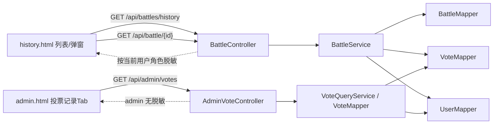

## 产品概述

在教育大模型对战评测平台中，补齐"投票人"信息的展示能力，让历史页、对战详情、后台管理都能追溯每一次投票由谁完成，用于内部评测复盘与数据审计。

## 核心功能

- **对战历史列表**：在 `/history` 页表格中新增"投票人"列，展示该场对战的投票人（displayName 优先，回退 username）。
- **对战详情弹窗**：修复当前 `detail.vote` 永远为 undefined 导致"投票详情"区不显示的 bug；在弹窗顶部 / 投票详情区显示投票人。
- **后台"投票记录" Tab**：管理员可按用户、时间、对战 ID 分页查看所有投票明细（投票人、对战、各维度选择、获胜方、时间）。
- **身份口径统一**：全部展示一律采用 `displayName 优先，回退 username`，与侧边栏一致。
- **权限脱敏**：服务端实施。admin 看全部真实投票人；普通 teacher 只有自己的投票显示真实信息，其他投票人一律显示为"匿名"。
- **后端接口增强**：`/api/battle/{id}` 返回体新增 `vote` 子对象（含脱敏后的 voter）；`/api/battles/history` 返回行新增 `voter` 字段；新增 `/api/admin/votes` 管理员分页接口。

## 技术栈

沿用现有项目栈，不引入新依赖：

- 后端：Spring Boot 3 + MyBatis-Plus + Lombok（与 `BattleServiceImpl` / `BattleController` 一致）
- 持久层：MySQL（`votes.user_id` / `users.display_name` 已存在，无需改表）
- 前端：Thymeleaf 模板 + 原生 JS + Bootstrap 5（与 `history.html`、`admin.html` 一致）
- 鉴权：`UserContext`（读取当前 userId/role）+ `AuthInterceptor`（管理员接口前缀 `/api/admin/*` 已有权限约束）
- 缓存：复用 `CacheService`（`battle:detail:{id}` 已有）

## 实施策略

**总思路**：Vote 表本身已有 `user_id`，只需在"查询—组装 VO—脱敏—展示"链路上补齐字段，不改 schema、不破坏缓存。按三个垂直切面展开：

1. **对战详情链路**（修 bug + 加字段）：

- 新增 `BattleVoteVO`（投票明细 + 脱敏后 voter）并挂到 `BattleVO.vote`。
- `BattleServiceImpl.buildBattleVO` 里按 `battleId` 查 vote + 投票人，**缓存层只存原始 voter 数据**（`voterUserId/voterUsername/voterDisplayName`），控制器层再按当前用户角色做脱敏。这样保证不同角色访问缓存数据时可正确脱敏，缓存仍可命中。

2. **对战历史列表链路**：

- `BattleMapper.selectHistoryPage` 的 SQL 中 `LEFT JOIN votes` 基础上再 `LEFT JOIN users` 拿到 `voter_user_id, voter_username, voter_display_name`。
- `BattleHistoryVO` 增加这 3 个原始字段 + 一个前端使用的展示字段 `voter`（控制器层脱敏后填充，JSON 只吐 `voter` + `voterUserId`，避免泄露真实 username 给非 admin）。

3. **后台投票记录链路**：

- 新增 `AdminVoteController`（或复用 `AdminController`）提供 `GET /api/admin/votes`，内部使用 `VoteMapper.selectVotePage`（新增注解 SQL，`JOIN users + battles + tasks + models`）。
- 仅 admin 角色可访问（`UserContext.getRole()` 校验 + 沿用已有拦截器语义）。
- 返回 `AdminVoteItemVO` 列表，管理员视角无脱敏。

**关键技术决策**

- **脱敏放在控制器层**：`BattleService` 返回"含真实 voter 的 VO"，在 `BattleController` / `AdminVoteController` 中根据 `UserContext.getRole()` + `voterUserId == currentUserId` 二次加工；好处是不污染缓存，也不会因查询缓存者与首次加载者角色不同造成脱敏错乱。
- **复用而非新建拦截器**：`/api/admin/*` 的权限约束沿用现有机制（通过查 `AuthInterceptor` 确认），仅在 controller 方法里加 `requireAdmin()` 保险丝。
- **历史页 SQL 继续用注解**：`BattleMapper.selectHistoryPage` 当前是 `@Select` 注解 SQL，保持一致，只在 SELECT 与 JOIN 中追加 `voter` 三字段，避免为 1 个字段切换到 XML Mapper。
- **一对战一投票假设**：现有 SQL 已用 `MAX(v.winner)`，表明业务语义是"每场对战最多一条投票"，因此列表页直接 LEFT JOIN 第一个 vote 足够；`BattleVoteVO` 同样只取首条。

**性能与稳定性**

- 历史分页 SQL 仅多 1 个 LEFT JOIN users，对既有聚合逻辑无影响；users 表已有 `id` 主键，成本忽略。
- 详情接口缓存不变，仅 VO 多一个 `vote` 字段；实际多一次 `votes by battle_id + users by id` 单点查询（每次 2 个 PK/索引查询，可控）。
- admin 投票列表加 `ORDER BY v.created_at DESC` + 分页 `LIMIT`，并支持按 `userId / battleId / date range` 过滤以避免全表扫描。
- 日志：沿用 `log.info` 投票记录查询，不新增大数据量打印，避免 PII 进日志。

## 实施要点

- **Grounded**：沿用 `Result<>` 包装、`IPage<>` 分页、`@JsonProperty`/Jackson snake_case 配置、`@TableField(exist=false)` 语义。
- **兼容性**：前端旧字段保持不变；新字段 `voter` 在无投票/权限不足时给 `null` 或 `"匿名"`，老前端忽略也不报错。
- **缓存失效**：投票时已调 `cacheService.invalidateBattle(battleId)`，自动覆盖新字段变化。
- **日志**：`AdminVoteController` 打印 `actor=admin userId xxx 查询 votes size=..., filters=...`，不打印投票内容本体。
- **Blast radius**：不改 `vote` 落库路径，不改 ELO 计算；新增接口默认不影响既有调用者。

## 架构

调用链路简图：



## 目录结构

### 目录结构说明

在现有 Spring Boot + Thymeleaf 项目基础上，新增 1 个控制器、1 个服务、3 个 VO/DTO，修改 5 个既有文件补齐字段与视图；数据库、依赖无变更。

```
edu-arena-java/
├── src/main/java/com/edu/arena/
│   ├── controller/
│   │   ├── BattleController.java                 # [MODIFY] /api/battle/{id} 与 /api/battles/history 返回体脱敏：注入 UserContext，在返回前根据角色把 voter 脱敏为"匿名"。
│   │   └── AdminVoteController.java              # [NEW] 管理员投票记录接口。GET /api/admin/votes（分页/按 userId、battleId、起止时间过滤）；入口处 requireAdmin()，调用 VoteQueryService。
│   ├── service/
│   │   ├── BattleService.java                    # [MODIFY] 保持既有接口；buildBattleVO 的脱敏契约放在控制器层，服务层仍返回"真实 voter"的 VO。
│   │   ├── VoteQueryService.java                 # [NEW] 定义 IPage<AdminVoteItemVO> pageVotes(filter) 接口，封装后台投票列表查询。
│   │   └── impl/
│   │       ├── BattleServiceImpl.java            # [MODIFY] buildBattleVO 内新增：按 battleId 查 Vote + User，组装 BattleVoteVO 挂到 BattleVO.vote；selectHistoryPage 改由 Mapper 层带 voter 字段返回，此处透传。
│   │       └── VoteQueryServiceImpl.java         # [NEW] 使用 VoteMapper.selectVotePage 返回管理员视角明细，不做脱敏。
│   ├── mapper/
│   │   ├── BattleMapper.java                     # [MODIFY] selectHistoryPage 注解 SQL 追加 LEFT JOIN users u ON u.id = v.user_id，SELECT 增加 v.user_id AS voterUserId, u.username AS voterUsername, u.display_name AS voterDisplayName。
│   │   └── VoteMapper.java                       # [MODIFY] 新增 IPage<AdminVoteItemVO> selectVotePage(Page, @Param filters)，注解 SQL 联 users/battles/tasks/models，返回明细。
│   ├── dto/
│   │   ├── response/
│   │   │   ├── BattleVO.java                     # [MODIFY] 新增字段 private BattleVoteVO vote（Jackson 默认 snake_case 即 vote）。
│   │   │   ├── BattleHistoryVO.java              # [MODIFY] 新增 private Long voterUserId; private String voterUsername; private String voterDisplayName; private String voter; （前端展示时读 voter）。
│   │   │   ├── BattleVoteVO.java                 # [NEW] 投票子对象：包含 voteId, winner, 6 维度 A/B/tie 值 + reason、createdAt，以及 voterUserId/voterUsername/voterDisplayName/voter 展示字段。
│   │   │   └── AdminVoteItemVO.java              # [NEW] 后台投票记录条目：投票 id、battleId、voterUserId/username/displayName、6 维度、winner（真实模型名/A|B|tie）、createdAt、essayTitle、modelA、modelB。
│   │   └── request/
│   │       └── AdminVoteQuery.java               # [NEW] 查询参数：page、size、userId、battleId、startDate、endDate（@RequestParam 绑定）。
│   └── common/utils/
│       └── UserContext.java                      # [READ] 复用 getUserId/getRole，不改动。
├── src/main/resources/
│   └── templates/
│       ├── history.html                          # [MODIFY] 表格 thead 增加"投票人"列；tbody 渲染 b.voter；详情弹窗修正 detail.vote 渲染（现在后端会返回），并在弹窗顶部 info-bar 显示投票人。
│       └── admin.html                            # [MODIFY] 新增 Tab 按钮"投票记录"并新增 panel-votes（表格 + 用户名/对战ID/日期筛选 + 分页），在 switchAdminTab 中触发 loadAdminVotes。
└── WIKI.md                                       # [MODIFY] 更新目录结构、接口列表、DTO 字段、前端页面改动；刷新"最后更新"日期（项目硬性约定）。
```

## 关键代码结构

```java
// BattleVoteVO.java（新）
public class BattleVoteVO {
    private Long voteId;
    private String winner;                 // A / B / tie
    private String dimTheme;               // A / B / tie（与 votes 表一致）
    private String dimImagination;
    private String dimLogic;
    private String dimLanguage;
    private String dimWriting;
    private String dimOverall;
    private String dimThemeReason;
    // ...其余 reason
    private Long   voterUserId;            // 原始（服务层返回）
    private String voterUsername;          // 原始（服务层返回）
    private String voterDisplayName;       // 原始（服务层返回）
    private String voter;                  // 展示用（控制器脱敏后填：displayName||username 或 "匿名"）
    private LocalDateTime createdAt;
}

// AdminVoteQuery.java（新）——仅字段签名
public class AdminVoteQuery {
    private Integer page = 1;
    private Integer size = 20;
    private Long userId;
    private Long battleId;
    private LocalDate startDate;
    private LocalDate endDate;
}

// VoteQueryService.java（新）
public interface VoteQueryService {
    IPage<AdminVoteItemVO> pageVotes(AdminVoteQuery query);
}
```

## Agent Extensions

### SubAgent

- **code-explorer**
- Purpose: 在实施"后台投票记录 Tab"时，快速定位 `AuthInterceptor` 对 `/api/admin/*` 的权限校验细节、`AdminController` 现有分页/筛选惯例，以及 `admin.html` 里 Tab 注册 + 分页组件的既有代码片段，避免偏离项目规范。
- Expected outcome: 产出一份"可直接照抄的样板"清单（拦截器校验方式、分页返回 JSON 结构、admin Tab 的 HTML/JS 骨架），供后续编码阶段复用，确保新接口/新 Tab 与既有风格一致。