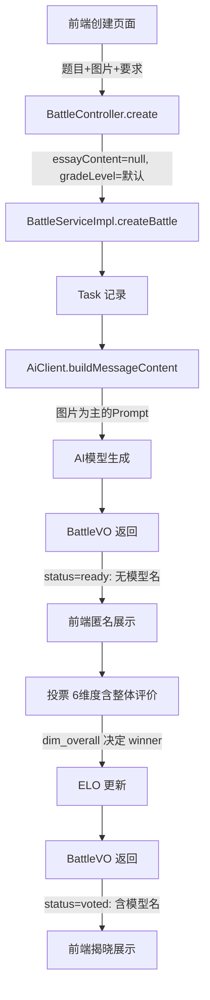

## 产品概述

对教育大模型众包式对战评测平台进行四大模块升级：精简创建页面、优化AI批改Prompt、强化匿名化机制、升级投票与胜负判定逻辑。

## 核心功能

### 1. 前端创建页面精简

- 移除"年级/学段"下拉选择框和"学生作文内容"文本域
- 删除前端 JavaScript 中的 `samples` 示例作文常量（含3篇示例作文：《论坚持的力量》《那个温暖的冬天》《春天来了》）及其相关的"试试示例"按钮和填充逻辑
- 仅保留：作文题目（必填）、图片上传（必填，改为主要输入方式）、批改要求（可选）
- 后端对已移除字段设置合理默认值：`gradeLevel` 默认"初中"、`essayContent` 允许为空

### 2. 大模型 Prompt 优化

- 适配"图片为主"的输入模式，强化图片识别指引（手写体识别、段落分割）
- 角色定义和评分标准保持不变，优化批改步骤中的图片场景描述
- 纯文本 `buildPrompt()` 方法需适配无正文情况的容错

### 3. 生成结果页面匿名化

- 投票前（status=ready）：后端不返回模型名称信息（`modelLeft`/`modelRight` 置空）
- 投票后（status=voted）：返回完整模型信息用于揭晓
- 前端 `showBattleResults()` 中移除对 `model_left`/`model_right` 的即时渲染，仅在 `showPostVote()` 中展示

### 4. 投票逻辑与数据库升级

- 数据库 `votes` 表新增 `dim_overall` 字段（整体评价维度：A/B/tie）和 `dim_overall_reason` 字段
- 前端投票UI新增"整体评价"维度行，作为第6个（也是最关键的）维度
- **胜负判定逻辑改变**：winner 直接取 `dim_overall` 的值，不再基于5个子维度多数决
- 5个子维度投票保留作为参考数据，但不参与胜负计算
- VoteRequest/Vote 实体/前端投票表单同步新增字段

## 技术栈

- 后端：Spring Boot 3.2.3 + Java 17 + MyBatis-Plus + MySQL + Redis
- 前端：Thymeleaf + Bootstrap 5 + 原生 JavaScript
- 无需引入新依赖

## 实现方案

### 方案概述

本次修改涉及前后端联动的4个独立模块，采用"数据库先行 -> 后端适配 -> 前端更新"的顺序实施，每个模块独立可测试。修改遵循项目现有的分层架构和编码风格（Lombok、MyBatis-Plus、snake_case JSON）。

### 关键技术决策

**1. 前端精简方案 — 软删除而非硬删除字段**

`essayContent` 和 `gradeLevel` 在数据库和后端保留，仅从前端移除并在后端填充默认值。原因：

- 已有历史数据依赖这些字段
- AiClient Prompt 中仍引用 `task.getEssayContent()`（图片模式下为空即可）
- 数据库 `tasks.essay_content` 列为 `TEXT NOT NULL`，需改为 `TEXT NULL` 或在后端确保填充默认空字符串
- `gradeLevel` 保持默认值 "初中"

**2. 匿名化方案 — 后端条件性返回**

在 `buildBattleVO()` 中根据 `battle.getStatus()` 决定是否设置 `modelLeft`/`modelRight`：

- `status = "ready"`：不设置模型信息（VO 中为 null）
- `status = "voted"`：正常设置模型信息

此方案优于"前端隐藏"，因为从根本上杜绝了通过 API/DevTools 获取模型名称的可能。

**3. 胜负判定改为整体评价维度**

新增 `dim_overall`（整体评价）字段，winner 直接取该字段值。5个子维度改为可选（去掉 `@NotBlank`），但保留在投票UI中供参考。这保证了：

- 向后兼容：旧投票数据不受影响
- ELO 计算逻辑不变，仅 winner 来源改变
- VoteResultVO 中 `aWins`/`bWins` 语义调整为子维度参考统计

## 实现注意事项

- **数据库迁移**：`votes` 表新增 2 个可空字段 `dim_overall` 和 `dim_overall_reason`，`tasks.essay_content` 改为允许 NULL，均为 ALTER TABLE 操作，不影响已有数据
- **缓存一致性**：修改 `buildBattleVO()` 后需确保 `CacheService` 中对战详情缓存在投票后正确刷新（现有逻辑 `invalidateBattle()` 已覆盖）
- **向后兼容**：`CreateBattleRequest` 中 `essayContent`/`gradeLevel` 字段保留但标记为可选，Python `agent-review-service` 的 `arena_dto.py` 无需强制修改
- **前端投票维度数从 5 改为 6**：确认按钮文案、进度计数器、提交校验都需同步更新

## 架构设计

数据流变化如下：



## 目录结构

```
src/main/
├── java/com/edu/arena/
│   ├── aiclient/
│   │   └── AiClient.java                    # [MODIFY] 优化 buildPrompt() 和 buildMessageContent()，适配图片为主模式，无 essayContent 时的容错
│   ├── controller/
│   │   └── BattleController.java            # [无需修改] 接口签名不变
│   ├── dto/
│   │   ├── request/
│   │   │   ├── CreateBattleRequest.java     # [MODIFY] essayContent 移除 @Size 约束或保留但不必填，gradeLevel 默认值改为"初中"
│   │   │   └── VoteRequest.java             # [MODIFY] 新增 dimOverall + dimOverallReason 字段，5个子维度从 @NotBlank 改为可选
│   │   └── response/
│   │       └── VoteResultVO.java            # [MODIFY] 调整语义，保留 aWins/bWins 作为参考统计
│   ├── entity/
│   │   ├── Task.java                        # [无需修改] 字段保留，后端填充默认值
│   │   └── Vote.java                        # [MODIFY] 新增 dimOverall + dimOverallReason 字段
│   └── service/
│       └── impl/
│           └── BattleServiceImpl.java       # [MODIFY] (1) createBattle 验证逻辑：图片必传 (2) buildBattleVO 匿名化 (3) vote 胜负判定改用 dimOverall
├── resources/
│   ├── db/
│   │   └── init_complete.sql                # [MODIFY] votes 表增加 dim_overall/dim_overall_reason 列，tasks.essay_content 改为允许 NULL
│   └── templates/
│       ├── battle.html                      # [MODIFY] (1) 创建表单移除年级、正文和 samples 示例常量 (2) 投票UI增加整体评价维度 (3) 匿名化：投票前不显示模型名
│       └── history.html                     # [MODIFY] 确保已投票对战才显示模型名
WIKI.md                                      # [MODIFY] 同步更新所有变更
```

## Agent Extensions

### SubAgent

- **code-explorer**
- 用途：在实施各任务时，若需要搜索 battle.html 中的具体 DOM 元素 ID、CSS 类名或 JavaScript 函数位置，使用此子代理进行精确定位
- 预期结果：快速找到需要修改的前端代码行号和上下文