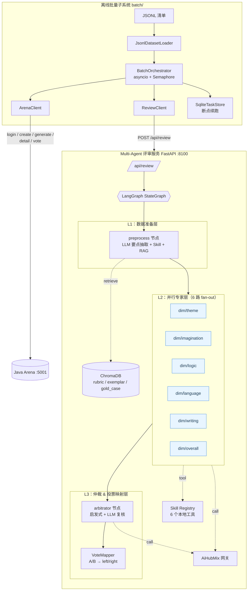

# agent-review-service

> **面向 `edu-arena-java` 对战平台的 Multi-Agent 作文批改「评审专家」系统**
> —— LangGraph 编排 · RAG 检索增强 · 6 维度专家 Agent 并行 · 离线批量端到端跑批
>
> 独立 Python 子项目，默认端口 **8100**；不侵入 Java 代码，仅通过 REST 与对战平台交互。

---

## 目录

1. [项目定位](#一项目定位)
2. [技术栈](#二技术栈)
3. [多智能体架构（重点）](#三多智能体架构重点)
4. [批量处理子系统](#四批量处理子系统)
5. [目录结构](#五目录结构)
6. [启动说明（服务 + 批量）](#六启动说明服务--批量)
7. [核心接口](#七核心接口)
8. [关键设计要点](#八关键设计要点)
9. [测试](#九测试)
10. [环境变量](#十环境变量)
11. [与 Java 平台的对齐要点](#十一与-java-平台的对齐要点)

---

## 一、项目定位

这个子项目同时承担两个角色：

| 角色 | 定位 | 入口 |
| --- | --- | --- |
| **Multi-Agent 评审服务** | 扮演「阅卷专家组」：对两份 AI 批改做 6 维度打分 + 仲裁 + 投票映射，替代人工评审 | FastAPI `http://localhost:8100` |
| **离线批量处理系统** | 扮演「考务流水线」：读 JSONL 清单 → 创建对战 → 触发生成 → 调评审服务 → 自动投票 → 落盘结果 | `python -m batch.cli run` |

两个系统通过 `app/contracts/` 共享 Pydantic DTO，字段 `snake_case` 严格对齐 Java 端 `JacksonConfig`，确保跨语言零摩擦。

---

## 二、技术栈

| 类别 | 选型 |
| --- | --- |
| 运行时 | Python 3.11+ |
| Web 框架 | FastAPI + Uvicorn |
| Agent 编排 | **LangGraph**（DAG + `Send` API 并行 fan-out / fan-in） |
| LLM 接入 | openai SDK（AiHubMix OpenAI 兼容网关） |
| RAG | ChromaDB（本地持久化）+ OpenAI Embedding（可降级为 hash 伪向量） |
| 数据建模 | Pydantic v2 |
| HTTP 客户端 | httpx（异步）+ tenacity（指数退避） |
| 状态持久化 | SQLite（零依赖、断点续跑） |
| 日志 | loguru（按天轮转 + 敏感字段自动脱敏） |

---

## 三、多智能体架构（重点）

### 3.1 设计理念

真实的人工作文阅卷，是一个**「多专家 → 综合意见 → 主审终裁」**的过程：

1. 不同维度由**不同专长的老师**分别评（主旨看立意、语言看用词、书写看卷面……）；
2. 每位老师只在自己擅长的维度里打分、给证据、给理由；
3. 最后由**主审**综合 6 位专家的打分，给出总冠军和最终置信度。

`agent-review-service` 把这套工作流用 LangGraph DAG 原封不动地实现了出来，并在每一步都嵌入了**客观工具（Skill）**和**历史参考资料（RAG）**来对抗 LLM 的主观漂移。

### 3.2 架构总览



### 3.3 6 维度评分键

| 维度 | 键 | 专家关注点 | 决定 winner？ |
| --- | --- | --- | --- |
| 主旨 | `theme` | 立意是否紧扣题意、中心是否明确 |   |
| 想象 | `imagination` | 构思新颖度、素材独特性 |   |
| 逻辑 | `logic` | 篇章结构、段落衔接、论证递进 |   |
| 语言 | `language` | 用词、句式、修辞、病句 |   |
| 书写 | `writing` | 卷面整洁、字迹工整、标点规范 |   |
| **整体评价** | **`overall`** | **综合维度（终裁依据）** | **✅ 决定最终 winner** |

### 3.4 各节点详解

#### ① `preprocess`（数据准备官）

**角色**：相当于阅卷组的「教研员」，在专家打分前先做客观材料准备。

**输入**：`BattleContext`（题目 + 两份批改 + 可选原文）。

**三件事并行做**：

1. **LLM 要点抽取**：分别对 A/B 两份批改调用 LLM，输出结构化 `ExtractedPoints`（亮点、问题、建议、摘要、字数）。
2. **Skill 客观指标**：调用 5~6 个本地工具：
   - `feedback_compare`：两份批改的相似度、长度差、verdict
   - `coverage_analyzer`：六维度的覆盖度
   - `grammar_check`：语法错误估计分
   - `duplicate_detect`：重复率
   - `text_stats`：字数/句数/段数
   - `hallucination_check`：**仅在提供原文时触发**，检测批改有无脱离原文的幻觉陈述
3. **RAG 检索**：按 6 个维度键分别到 ChromaDB 的三个集合（`rubric` 评分标准 / `exemplar` 范文 / `gold_case` 标杆卷）中做 top-3 检索，为每个维度准备参考语料。

**输出**：`extracted_a/b`、`skill_summary`、`rag_hits`（按维度 key 组织）。

#### ② `dispatch_dimensions`（条件边 · 并行分派）

这是 LangGraph DAG 里**唯一的条件边**。它不是节点，而是一个返回 `List[Send]` 的函数，负责把 `preprocess` 的产物**切片打包**成 6 份 payload，通过 `Send API` 并行扇出到 6 个 `dimension_agent` 实例。

```python
for dim in DimensionKey:  # theme / imagination / logic / language / writing / overall
    sends.append(Send("dimension_agent", {
        "ctx": ctx,
        "current_dim": dim,
        "skill_summary": skill_summary,
        "rag_hits_for_dim": rag_hits[dim.value],
    }))
```

LangGraph 的 `Send API` 保证这 6 次调用是**真正并行**的，平均耗时 ≈ 最慢的那一路（而不是 6 路串行之和）。

#### ③ `dimension_agent` × 6（6 位评分专家）

**角色**：6 个参数化的同一节点，通过 payload 里的 `current_dim` 告诉它"你现在是主旨老师 / 语言老师 / …"。

**每个专家的流水线**：

1. 按维度**裁剪 Skill 摘要**：只保留与本维度强相关的指标（如语言老师看 `grammar/duplicate`，主旨老师看 `hallucination`）。
2. 构造**维度专用 system prompt**（`dim_system_prompt(dim)`）+ 用户 prompt（注入 RAG 片段 + 两份批改正文前 4000 字 + Skill 摘要 JSON）。
3. 调 LLM 要求 JSON 输出 → 解析为 `DimensionScore`：
   ```json
   {
     "score_a": 4.0, "score_b": 3.2,
     "winner": "A|B|tie",
     "reason": "...", "evidence": ["...", "..."],
     "confidence": 0.82
   }
   ```
4. 若 LLM 失败 → **降级返回 tie（conf=0.2）**，保证整个图不会因为单维度失败而失败（graceful degrade）。

**关键机制**：所有专家返回 `{"dimension_scores": [score]}`，LangGraph 通过 `Annotated[List[DimensionScore], operator.add]` 把 6 份单元素列表**自动合并**为 `[score_theme, score_imagination, …, score_overall]`。

#### ④ `arbitrator`（主审 · 启发式 + LLM 复核）

**角色**：综合 6 位专家的意见，产出最终结论。使用**两档策略**避免对 LLM 的过度依赖：

```
           ┌──────────────────────────────────────┐
           │  OVERALL 专家的 confidence ≥ 0.6 ?   │
           └────────────┬─────────────────────────┘
                   是   │   否
              ┌─────────┘───────────┐
              ▼                     ▼
   ┌─────────────────────┐ ┌─────────────────────────────────┐
   │ 启发式直接采信       │ │ 调 gpt-5 (arbitrator model) 复核 │
   │ final = OVERALL.winner│ │ 返回 rationale + adjusted_dims  │
   │ conf = 6 维平均 conf  │ │ ★ 但 final_winner 仍强约束       │
   └─────────────────────┘ │   == OVERALL.winner；冲突则回退   │
                           └─────────────────────────────────┘
```

> ✨ **强约束**：`final_winner` **必须**等于 `OVERALL 维度的 winner`，否则视为 LLM 幻觉、强制回退。这条规则是该系统的最后一道防线。

**输出**：`ArbitrationResult { final_winner, overall_confidence, rationale, adjusted_dimensions[] }`。

#### ⑤ `VoteMapper`（投票映射官，非 LangGraph 节点）

`arbitrator` 之后由 `ReviewService` 调用，负责把内部的 `A/B/tie` 结论**翻译**成 Java 对战平台能接受的 `left/right/tie`。

**两条映射规则**：

1. **方向映射**：Java `displayOrder="normal"` 时，内部 `A → left`、`B → right`、`tie → tie`。
2. **阈值收敛**：子维度若 `|score_a − score_b| < DIM_SCORE_TIE_THRESHOLD`（默认 0.5），**强制改判 tie**，消除 LLM 在微小差距上的抖动。

最终产出 `VotePayload`，包含 6 对 `dim_xxx / dim_xxx_reason` 字段，可直接作为 `POST /api/battle/{id}/vote` 的请求体。

### 3.5 控制流 & 归约机制一览

```
    START
      │
      ▼
   preprocess         ──────▶ 产出 extracted_{a,b} / skill_summary / rag_hits
      │ (conditional edge)
      ▼
   dispatch_dimensions         返回 6×Send[dimension_agent, payload]
      │      │      │      │      │      │
      ▼      ▼      ▼      ▼      ▼      ▼
    theme  imag.  logic  lang.  writ.  overall     ── 6 路真正并行
      │      │      │      │      │      │        ── Annotated[..., operator.add] 自动归并
      └──────┴──────┴──┬───┴──────┴──────┘
                       ▼
                   arbitrator    ── 启发式 + LLM 复核 + OVERALL 强约束
                       │
                       ▼
                      END
                       │ (service 层)
                       ▼
                  VoteMapper     ── A/B/tie → left/right/tie + 阈值 tie
```

### 3.6 容错与降级总览

| 失败点 | 降级策略 |
| --- | --- |
| LLM 要点抽取 (`preprocess`) | 退化为只填 `word_count`，不影响后续维度评审 |
| 单个 Skill 抛错 | 记 warning 日志，继续其余 Skill |
| RAG 检索失败 | 该维度的 `rag_hits` 为空，维度 Agent 自行推理 |
| 单维度 Agent LLM 失败 | 返回 `tie + conf=0.2` 的保守结果，不阻塞其他 5 路 |
| 仲裁 LLM 失败 | 走启发式（直接采信 OVERALL 专家） |
| Embedding 服务不可用 | 降级为 hash 伪向量，保证 ChromaDB 可用 |

---

## 四、批量处理子系统

离线 `batch/` 子系统负责**端到端跑批**：把一份 JSONL 清单里的 N 条作文，全自动地过完「创建对战 → 生成两份批改 → Multi-Agent 评审 → 自动投票 → 结果落盘」这条链路。

### 4.1 状态机

每条作文在 `SqliteTaskStore` 里都有一个独立的状态：

```
pending ──▶ created ──▶ generated ──▶ reviewed ──▶ voted ──▶ done
    │         │            │             │           │
    └─────────┴────────────┴─────────────┴───────────┴──▶ failed
```

| 阶段转移 | 做的事 | 关联接口 |
| --- | --- | --- |
| `pending → created` | 编码图片（local/url/base64 统一压成 ≤2MB base64）+ 创建对战 | Java `POST /api/battle/create` |
| `created → generated` | 触发两份 AI 批改；若请求超时自动降级为轮询 `/api/battle/{id}` | Java `GET /api/battle/{id}/generate` |
| `generated → reviewed` | 调 Multi-Agent 评审服务做 6 维打分 + 仲裁 | 本服务 `POST /api/review` |
| `reviewed → voted` | 把 `VotePayload` 提交投票（`--dry-run` 时跳过） | Java `POST /api/battle/{id}/vote` |
| `voted → done` | 标记完成、记录耗时 | — |

### 4.2 三大可靠性机制

- **断点续跑**：SQLite 以 `item_id` 为主键记录阶段；进程中断后重启会**从最后成功阶段继续**，不会重复创建对战或投票。
- **幂等保护**：
  - 创建阶段：若 `battle_id` 已在 store 中 → 跳过创建；
  - 生成阶段：若对战已是 `ready / voted` → 跳过生成；
  - 投票阶段：Java 端有 `UNIQUE(battle_id, user_id)` 强约束；若返回 `409 / "已投票"` → 视为成功。
- **并发 + 背压**：`asyncio.Semaphore(concurrency)` 控制同时在飞的 battle 数，避免压垮评审服务或 Java 端。

---

## 五、目录结构

```
agent-review-service/
├── app/                              # Multi-Agent 评审服务
│   ├── main.py                       # FastAPI 入口（python -m app.main）
│   ├── settings.py                   # pydantic-settings 配置
│   ├── contracts/                    # ★ 与 Java 共享的 DTO 契约
│   │   ├── arena_dto.py              #   对战平台 5 个接口 DTO
│   │   ├── review_dto.py             #   ReviewRequest / ReviewResponse / VotePayload
│   │   ├── review_models.py          #   领域模型（DimensionScore / ReviewReport ...）
│   │   └── dataset_dto.py            #   离线清单 DatasetItem
│   ├── review/                       # ★ 多智能体核心
│   │   ├── graph.py                  #   LangGraph StateGraph 装配
│   │   ├── state.py                  #   GraphState（TypedDict + operator.add 归约）
│   │   ├── llm.py                    #   OpenAI 兼容客户端（JSON mode + 多模态）
│   │   ├── prompts.py                #   各节点 prompt 模板
│   │   ├── decision.py               #   VoteMapper
│   │   ├── service.py                #   ReviewService 外观
│   │   └── nodes/
│   │       ├── preprocess.py         #   数据准备官
│   │       ├── dispatch.py           #   6 路并行分派
│   │       ├── dimension_agent.py    #   评分专家（参数化）
│   │       └── arbitrator.py         #   主审（启发式 + LLM 复核）
│   ├── rag/                          # ChromaDB 三集合（rubric / exemplar / gold_case）
│   │   ├── store.py / retriever.py / embedding.py
│   │   └── seed/
│   ├── skills/                       # 6 个本地工具（BaseSkill + 注册表）
│   │   ├── text_stats / grammar_check / duplicate_detect
│   │   └── feedback_compare / coverage_analyzer / hallucination_check
│   ├── api/
│   │   ├── review_router.py          #   /api/review, /api/health
│   │   └── admin_router.py           #   /api/rag/{seed, upsert, stats}
│   └── common/                       # logger / exceptions / retry
├── batch/                            # 离线批量子系统
│   ├── cli.py                        # `python -m batch.cli {run|status}`
│   ├── orchestrator.py               # 并发 + 断点续跑编排器
│   ├── dataset_loader.py             # JSONL 加载
│   ├── image_encoder.py              # local / url / base64 → 压缩 base64
│   ├── arena_client.py               # Java 平台 5 个接口封装
│   ├── review_client.py              # 调 /api/review
│   ├── task_store.py                 # SqliteTaskStore
│   └── vote_builder.py               # VotePayload → ArenaVoteRequest
├── scripts/
│   ├── init_rag.py                   # 从 seed 导入 RAG
│   ├── gen_dataset.py                # resource/*.txt + picture/ → JSONL
│   └── run_batch.sh                  # 一键启停脚本
├── resource/                         # 作文 txt 描述（人工评分 + 评语）
├── picture/                          # 作文原图（0001.jpg, 0002.jpg ...）
├── tests/                            # pytest（≈146 用例）
├── data/
│   ├── sample_dataset.jsonl          # 示例清单
│   ├── batch_tasks*.sqlite           # 运行态任务状态
│   └── chroma/                       # 向量库持久化目录
├── logs/                             # 运行日志（按天轮转）
├── requirements.txt
├── pyproject.toml
└── .env.example
```

---

## 六、启动说明（服务 + 批量）

这一节是「**从零到端到端跑通**」的完整路线图。分 4 段：环境 → 评审服务 → 批量数据 → 批量运行。

### 6.1 环境准备（一次性）

```bash
cd agent-review-service

# 1) 虚拟环境（推荐 Python 3.11）
python -m venv .venv
source .venv/bin/activate

# 2) 依赖
pip install -r requirements.txt

# 3) 配置
cp .env.example .env
# 至少需要配置：
#   AI_API_KEY            → AiHubMix / OpenAI 兼容 Key
#   ARENA_BASE_URL        → Java 对战平台（默认 http://localhost:5001）
#   ARENA_USERNAME/PASSWORD → admin/admin123（默认）
```

#### （可选）初始化 RAG 知识库

```bash
python scripts/init_rag.py --reset
# 或启动服务后调管理接口：
# curl -X POST http://localhost:8100/api/rag/seed \
#      -H 'Content-Type: application/json' -d '{"reset":true}'
```

---

### 6.2 启动 Multi-Agent 评审服务

评审服务（FastAPI + LangGraph）是**独立长驻进程**，默认监听 **:8100**。

#### 方式 A：前台启动（开发调试首选）

```bash
cd agent-review-service
source .venv/bin/activate

python -m app.main
# 看到 "Uvicorn running on http://0.0.0.0:8100" 即就绪
```

验证：

```bash
curl http://localhost:8100/api/health              # 健康检查
open  http://localhost:8100/docs                   # Swagger UI
```

#### 方式 B：后台常驻（生产 / 共享调试环境）

```bash
cd agent-review-service
source .venv/bin/activate

mkdir -p logs
nohup python -m app.main > logs/review_server.out 2>&1 & disown
echo "review_pid=$!"

# 等就绪：
until curl -sSf http://localhost:8100/api/health >/dev/null; do sleep 1; done
echo "ready"
```

停止：

```bash
pkill -f "python -m app.main"
```

#### 方式 C：带热重载（改代码就重启，仅限开发）

```bash
uvicorn app.main:app --host 0.0.0.0 --port 8100 --reload
```

> **性能调优**：默认单 worker。若做压测可用 `uvicorn app.main:app --workers 2`；但 LangGraph graph 实例是进程内单例，多 worker 下会有多份内存副本，注意 RAM。

---

### 6.3 准备批量数据

批量系统吃的是 **JSONL 清单**。两种做法：**手写清单**（轻量）或**从 `resource/*.txt` 自动生成**（推荐）。

#### 6.3.1 JSONL 清单格式

每行一个 JSON 对象：

```json
{
  "item_id": "essay-001",
  "essay_title": "记一次难忘的秋游",
  "images": [
    {"kind": "local",  "path": "./picture/0001.jpg"},
    {"kind": "url",    "path": "https://example.com/page2.jpg"},
    {"kind": "base64", "data": "iVBORw0KGgo..."}
  ],
  "essay_content": "（可选）原作文正文或 OCR 转写",
  "grade_level": "初中",
  "requirements": "（可选）批改特殊要求",
  "metadata": {"source": "dataset-v1"}
}
```

| 字段 | 必填 | 说明 |
| --- | --- | --- |
| `item_id` | ✅ | 唯一 ID，用于断点续跑去重 |
| `essay_title` | ✅ | 作文题目 |
| `images` | ✅ | 至少一张；支持 `local` / `url` / `base64` |
| `essay_content` | ❌ | 有则提升评审质量（触发幻觉检测） |
| `grade_level` | ❌ | 默认 `"初中"` |
| `requirements` | ❌ | 批改特殊要求 |
| `metadata` | ❌ | 自定义透传 |

#### 6.3.2 用 `resource/*.txt` 自动生成 JSONL（推荐）

**目录约定**：

```
agent-review-service/
├── picture/              # 作文图片（以序号命名：0001.jpg, 0002.jpg ...）
├── resource/             # 描述文件
│   └── essays.txt        # 每行：<图片名> <题目> <6 个分数> <评语>
└── data/
    └── dataset.jsonl     # ← 脚本自动生成
```

**txt 行格式**：

```
<图片文件名> <作文题目/要求全文> <主旨分> <想象分> <逻辑分> <语言分> <书写分> <总分> <人工评语>
```

示例：

```
0001.jpg 读下面的材料，然后作文。一只蜗牛... 8 6 8 8 3 33 这篇作文以"生命的意义在于奔跑"为主题...
0002.jpg 请以"原来，我也很______"为题... 8 7 8 8 3 34 这篇记叙文以"泰山登顶"为载体...
```

**生成命令**：

```bash
# 默认：扫描 resource/*.txt + picture/ → data/dataset.jsonl
python scripts/gen_dataset.py

# 指定参数
python scripts/gen_dataset.py \
  --txt resource/essays.txt \
  --pictures picture/ \
  --output data/dataset.jsonl \
  --grade 初中

# 多个 txt 合并
python scripts/gen_dataset.py \
  --txt resource/batch1.txt resource/batch2.txt \
  --output data/all_essays.jsonl
```

脚本会：正则提取 6 个连续数字拆分题目/分数/评语 → 智能提取短标题（识别 `《》`、"以...为题"） → 绑定图片 → 写入 `metadata.human_scores` 和 `metadata.human_comment` → 输出 `DatasetItem` 兼容 JSONL。

---

### 6.4 跑批（两种启动方式）

> **前置条件**：Java 对战平台已启动（默认 `:5001`）、`.env` 配置正确、图片就位。
> 批量系统的**完整链路依赖评审服务**——所以必须先起 `:8100`。

#### 方式 1：一键脚本（生产推荐）⭐

```bash
cd agent-review-service

# 自动：① 后台拉起评审服务 → ② 轮询 /api/health 就绪 → ③ 跑批 → ④ 退出时清理子进程
./scripts/run_batch.sh -i data/sample_dataset.jsonl -c 3

# dry-run（只评审不投票）
./scripts/run_batch.sh -i data/sample_dataset.jsonl -c 3 --dry-run
```

脚本动作：

1. `python -m app.main > logs/review_server.out 2>&1 &`（后台）
2. 循环 curl `/api/health` 最多 30s 等就绪
3. `python -m batch.cli run -i ... -c ... [--dry-run]`
4. `trap cleanup EXIT INT TERM` 确保 Ctrl+C 时自动 kill 评审服务

参数：

| 参数 | 缺省 | 说明 |
| --- | --- | --- |
| `-i / --input` | `data/sample_dataset.jsonl` | JSONL 清单路径 |
| `-c / --concurrency` | `$BATCH_CONCURRENCY` 或 3 | 并发对战数 |
| `--dry-run` | 关 | 只做评审、不提交投票 |

#### 方式 2：手动分步（调试 / 想长期持有评审服务时）

```bash
# ---------- 终端 1：启动评审服务（保持运行） ----------
cd agent-review-service
source .venv/bin/activate
python -m app.main
# 等到看到 "Uvicorn running on http://0.0.0.0:8100"

# ---------- 终端 2：跑批 ----------
cd agent-review-service
source .venv/bin/activate

# 先 dry-run 试跑（推荐，先确认链路通）
python -m batch.cli run -i data/sample_dataset.jsonl --dry-run

# 正式跑（含投票）
python -m batch.cli run -i data/sample_dataset.jsonl -c 3

# 查任务状态
python -m batch.cli status
```

#### CLI 完整参数

```bash
python -m batch.cli run \
  -i  data/sample_dataset.jsonl \   # 必需：JSONL 清单
  -c  3 \                            # 可选：并发数（默认 BATCH_CONCURRENCY，兜底 3）
  --dry-run \                        # 可选：只评审不投票
  --store ./data/tasks.sqlite \      # 可选：任务状态 SQLite 路径（默认 BATCH_STORE_PATH）
  -o  ./data/results.jsonl           # 可选：结果 JSONL 输出

python -m batch.cli status \
  --store ./data/tasks.sqlite        # 可选：查看指定库的任务统计
```

#### 结果产物

跑完之后会留下：

| 路径 | 内容 |
| --- | --- |
| `data/batch_tasks.sqlite` | 每条作文的阶段、battle_id、错误、耗时 |
| `data/results.jsonl`（`-o` 指定时） | 每行一条：`{item_id, battle_id, stage, winner, latency_ms, error?}` |
| `logs/review_server.out` | 评审服务日志（一键脚本） |
| `logs/app.log.YYYY-MM-DD` | loguru 按天轮转日志 |

断点续跑：**直接重复运行同一条命令即可**，已 `done` 的会跳过，`failed` 的会从失败阶段重试。

#### 前置条件检查清单

| 检查项 | 说明 |
| --- | --- |
| `.env` 的 `AI_API_KEY` 已配置 | Multi-Agent 评审要调 LLM |
| `.env` 的 `ARENA_BASE_URL` 可达 | 批量系统要 create/generate/vote |
| `.env` 的 `ARENA_USERNAME/PASSWORD` 正确 | 批量系统要登录对战平台 |
| Java 对战平台已启动（默认 `:5001`） | create/generate/vote 的后端 |
| 作文图片已就位 | 清单里的 `local` 路径必须存在 |
| （可选）RAG 已初始化 | 有知识库可提升评审质量 |

---

## 七、核心接口

### 7.1 `POST /api/review`

**请求体** (`ReviewRequest`)：

```json
{
  "battle_id": 42,
  "essay_title": "记一次难忘的秋游",
  "response_a": "...批改A全文...",
  "response_b": "...批改B全文...",
  "essay_content": "原作文（可选）",
  "grade_level": "初中",
  "requirements": "重点关注主旨与逻辑"
}
```

**响应体** (`ReviewResponse`)：

```json
{
  "report": {
    "battle_id": 42,
    "dimensions": [
      {"dim": "theme", "score_a": 4.0, "score_b": 3.2, "winner": "A",
       "reason": "...", "evidence": ["..."], "confidence": 0.82},
      "..."
    ],
    "final_winner": "A",
    "overall_confidence": 0.78,
    "review_version": "v1"
  },
  "vote_payload": {
    "dim_theme": "left",        "dim_theme_reason": "...",
    "dim_imagination": "tie",   "dim_imagination_reason": "...",
    "dim_logic": "right",       "dim_logic_reason": "...",
    "dim_language": "left",     "dim_language_reason": "...",
    "dim_writing": "tie",       "dim_writing_reason": "...",
    "dim_overall": "left",      "dim_overall_reason": "..."
  },
  "latency_ms": 6842,
  "model_trace": {"preprocess": "done", "latency_ms": 6842}
}
```

`vote_payload` 可直接作为 `POST /api/battle/{id}/vote` 的请求体。

### 7.2 其他接口

| 接口 | 作用 |
| --- | --- |
| `GET /api/health` | 健康检查 |
| `GET /api/rag/stats` | 查看 3 个集合文档数 |
| `POST /api/rag/seed` | 从 `app/rag/seed/` 导入（可 `reset=true`） |
| `POST /api/rag/upsert` | 追加单条知识 |

---

## 八、关键设计要点

1. **LangGraph DAG + Send API**：6 个维度专家**真正并行**（不是串行 for-loop），耗时取最慢一路。
2. **仲裁强约束**：`final_winner` 强制与 `OVERALL.winner` 一致，LLM 若冲突则回退——对抗幻觉的最后防线。
3. **Skill 而非 MCP**：6 个工具都是 Python 内部纯函数，经 `SkillRegistry` 单例暴露，零部署成本、零网络依赖。
4. **RAG 分维度检索**：6 个维度各自做 top-3 检索，避免大而无当的上下文稀释专家判断。
5. **投票映射与阈值 tie**：`VoteMapper` 把 A/B → left/right；子维度 `|a−b| < 0.5` 强制 tie，消除 LLM 抖动。
6. **断点续跑**：SQLite 以 `item_id` 为主键；进程挂了、机器重启都能从最后成功阶段续跑，不重复扣费。
7. **敏感脱敏**：logger 把 base64 压成 `前12字符...<base64len=N>`；`api_key/token/password` 自动替换为 `***`。
8. **降级三板斧**：LLM 失败 → 启发式；Embedding 失败 → hash 伪向量；Skill 失败 → 跳过单个工具。

---

## 九、测试

```bash
# 全部（≈146 用例）
pytest tests/ -v

# 覆盖率
pytest tests/ --cov=app --cov=batch --cov-report=term-missing

# 单模块
pytest tests/test_graph_smoke.py -v
pytest tests/test_batch.py -v
```

| 测试文件 | 用例数 | 覆盖 |
| --- | --- | --- |
| `test_contracts.py` | 6 | Pydantic DTO / snake_case / Java 对齐 |
| `test_decision.py` | 16 | VoteMapper A/B→left/right / 阈值 / 兜底 |
| `test_vote_mapper.py` | 4 | 分差阈值 / tie 兜底 / 理由截断 |
| `test_skills.py` | 7 | 6 个 Skill 的输入输出 |
| `test_rag.py` | 16 | Embedding fallback / Chroma CRUD / Retriever 缓存 |
| `test_llm_client.py` | 10 | JSON 解析 / 重试 / 异常 |
| `test_review_nodes.py` | 14 | preprocess / dimension_agent / dispatch / arbitrator |
| `test_service.py` | 10 | ReviewService 外观 / 维度合并 / 边界 |
| `test_graph_smoke.py` | 3 | A 赢 / B 赢 / tie 端到端 |
| `test_batch.py` | 21 | task_store / image_encoder / loader / orchestrator |
| `test_api.py` | 12 | FastAPI 路由：health / review / RAG 管理 |

---

## 十、环境变量

参考 `.env.example`：

| 变量 | 默认 | 说明 |
| --- | --- | --- |
| `AI_API_KEY` | — | OpenAI 兼容 API Key（必填） |
| `AI_BASE_URL` | `https://api.aihubmix.com/v1` | LLM 网关地址 |
| `AI_REVIEW_MODEL` | `gpt-5-mini` | 维度 Agent 使用模型（6 路并行，要快且省） |
| `AI_ARBITRATOR_MODEL` | `gpt-5` | 仲裁使用模型（综合裁决，要最强推理） |
| `AI_TIMEOUT` | `90` | LLM 单次超时秒 |
| `AI_MAX_RETRIES` | `3` | LLM 失败重试次数 |
| `ARENA_BASE_URL` | `http://localhost:5001` | Java 平台地址 |
| `ARENA_USERNAME/PASSWORD` | `admin/admin123` | 登录凭据 |
| `REVIEW_HOST` | `0.0.0.0` | FastAPI 绑定地址 |
| `REVIEW_PORT` | `8100` | FastAPI 端口 |
| `REVIEW_URL` | `http://localhost:8100` | 批量客户端调用地址 |
| `CHROMA_DIR` | `./data/chroma` | 向量库持久化目录 |
| `EMBEDDING_PROVIDER` | `openai` | `openai` / 或 hash 降级 |
| `EMBEDDING_MODEL` | `text-embedding-3-small` | Embedding 模型 |
| `BATCH_STORE_PATH` | `./data/batch_tasks.sqlite` | 任务状态 SQLite 路径 |
| `BATCH_CONCURRENCY` | `3` | 批量并发数 |
| `LOG_LEVEL` | `INFO` | 日志级别 |
| `LOG_DIR` | `./logs` | 日志目录（按天轮转） |
| `DIM_SCORE_TIE_THRESHOLD` | `0.5` | 子维度分差强制 tie 阈值 |

---

## 十一、与 Java 平台的对齐要点

- **投票值**：Java `VoteRequest` 有 `@Pattern(^(left|right|tie)$)` 强校验，**不接受 A/B**，由 `VoteMapper` 负责翻译。
- **创建请求**：`images` 必传、且是**纯 base64**（无 `data:image` 前缀），`ImageEncoder` 已自动剥离并 Pillow 压缩至 ≤2MB / 张。
- **生成接口**：是 `GET /api/battle/{id}/generate`（**非 POST**）；若请求超时，`orchestrator` 会自动降级为轮询 `/api/battle/{id}` 直到 `status != "generating"`。
- **对战返回**：只返回 `response_left / response_right`，不含 `response_a/b`；本服务约定 `left==A、right==B`。
- **幂等**：`UNIQUE(battle_id, user_id)` 保护重复投票；`409 / "已投票"` 视为成功。
